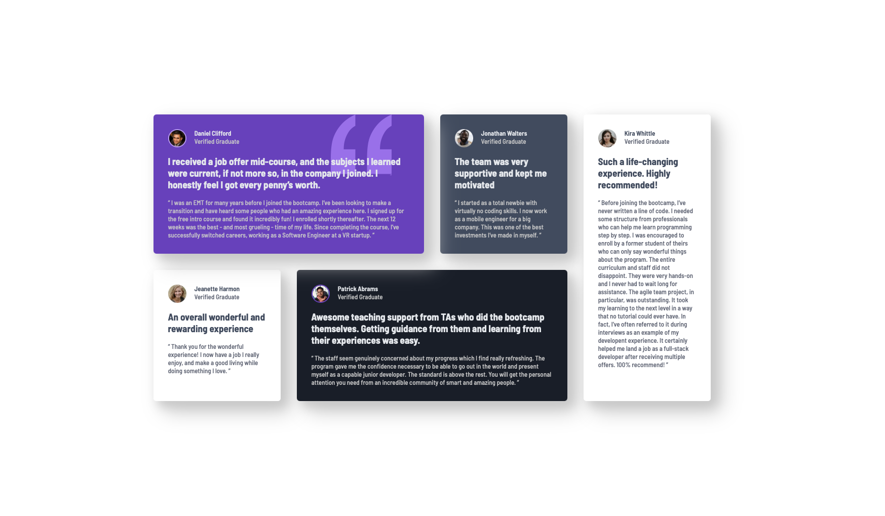

# Frontend Mentor - Testimonials grid section solution

This is a solution to the [Testimonials grid section challenge on Frontend Mentor](https://www.frontendmentor.io/challenges/testimonials-grid-section-Nnw6J7Un7). Frontend Mentor challenges help you improve your coding skills by building realistic projects. 

## Table of contents

- [Overview](#overview)
  - [The challenge](#the-challenge)
  - [Screenshot](#screenshot)
  - [Links](#links)
- [My process](#my-process)
  - [Built with](#built-with)
  - [What I learned](#what-i-learned)
  - [Continued development](#continued-development)
  - [Useful resources](#useful-resources)
- [Author](#author)
- [Acknowledgments](#acknowledgments)

## Overview

### The challenge

Users should be able to:

- View the optimal layout for the site depending on their device's screen size

### Screenshot

### Links

- Solution URL: [GitHub](https://github.com/KaiWenzel/testimonials-grid-section-main)
- Live Site URL: [Pages](https://kaiwenzel.github.io/testimonials-grid-section-main/)

## My process

### Built with

- Semantic HTML5 markup
- CSS
- Flexbox
- CSS Grid
- Mobile-first workflow
- [SASS](https://sass-lang.com) - CSS Pre-Processor

### What I learned

When you work with cards it's quite useful to just use flexbox since this is easier setup and then go for the more complex desktop design with Grid. 

### Continued development

In future projects I would like to maybe focus a bit more on animations. But maybe that's for a later time? 

### Useful resources

- [w3schools](https://www.w3schools.com/css/default.asp) - Everything regarding CSS.
- [Gemini](https://gemini.google.com/) - Helpful for finding errors in your code quickly.

## Author

- Website - Kai Wenzel (No official Website yet)
- Frontend Mentor - [@KaiWenzel](https://www.frontendmentor.io/profile/KaiWenzel)

## Acknowledgments

Thanks to Frontend Mentor for providing me with the design. 
